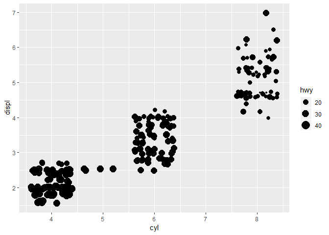

Homework 1: ggplot2
================
Valentina Bozok
2019-03-06

``` r
library(ggplot2)
```

By using *mpg* dataset:

#### 1. Map a continuous variable to color, size, and shape. How do these aesthetics behave differently for categorical vs. continuous variables?

*Answer: Continuous variables are colored gradiently and categorical variables define distinct color to each category independently. Analogically with the other aesthetics.*

-   Color

``` r
ggplot(data = mpg) +
  geom_jitter(mapping = aes(x = cyl, y = displ, color = hwy))
```


-   Size

``` r
ggplot(data = mpg) +
  geom_jitter(mapping = aes(x = cyl, y = displ, size = hwy))
```



-   Shape

*A continuous variable can not be mapped to shape*

#### 2. What happens if you map the same variable to multiple aesthetics?

``` r
ggplot(data = mpg) +
  geom_jitter(mapping = aes(x = cyl, y = displ, size = hwy, color = hwy))
```


#### 3. What does the stroke aesthetic do? What shapes does it work with? (Hint: use ?geom\_point)

*Answer: Stroke defines the thicknes on the border of the shape, so it obviously works only for shapes with fill and outline.*

``` r
ggplot(data = mpg) +
  geom_jitter(mapping = aes(x = cyl, y = displ),shape = 23, fill = 'red', stroke = 1)
```


``` r
ggplot(data = mpg) +
  geom_jitter(mapping = aes(x = cyl, y = displ), shape = 23, fill = 'red', stroke = 3)
```


#### 4. What happens if you map an aesthetic to something other than a variable name, like aes(colour = displ &lt; 5)?

``` r
ggplot(data = mpg) +
  geom_jitter(mapping = aes(x = cyl, y = displ, size = hwy, color = hwy < 25))
```


